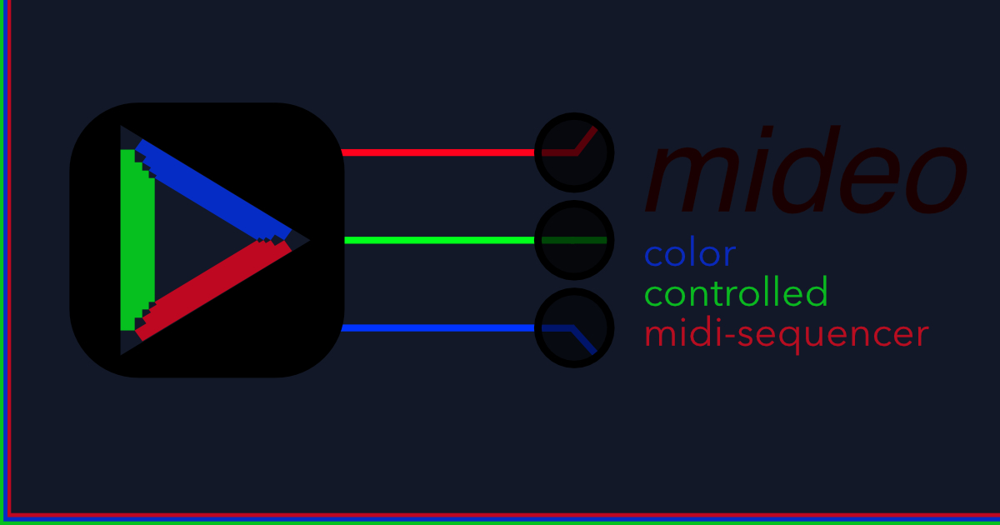

# MIDEO

**Video-driven MIDI automation for creative sound design.**

Turn any video into a MIDI controller. MIDEO extracts color data from video frames and translates RGB values into MIDI CC messages in real-time. Perfect for automating parameters in your DAW with visual content.

## <i class="bi bi-palette"></i> What It Does

Place cursors anywhere on a playing video. Each cursor samples the color beneath it and outputs three MIDI CC values (RGB channels, 0-127). Connect to Ableton, Logic, Bitwig, or any MIDI-capable software to automate filters, effects, or any parameter you can imagine.

**Core features:**
- Real-time color sampling with multiple cursor positioning
- Standard MIDI CC output (compatible with all DAWs)
- DAW-style controls: mute, solo, enable per channel
- Touch and desktop support with drag positioning
- 100% offline processing

---

## <i class="bi bi-gear-fill"></i> Setup

### MIDI Bus Configuration

Before anything else, you need a virtual MIDI bus so your DAW can receive MIDEO's output.

**macOS**  
Open Audio MIDI Setup → Window → Show MIDI Studio → Double-click IAC Driver → Check "Device is online"

**Windows**  
Download [loopMIDI](https://www.tobias-erichsen.de/software/loopmidi.html), create a virtual port

**Linux**  
Use ALSA (`modprobe snd-virmidi`) or JACK MIDI

### Getting Started

1. **Load your video** - Drag & drop or click to browse (MP4, WebM, MOV, AVI, MKV)
2. **Enable cursor overlay** - Click the three dots button in the control bar
3. **Place cursors** - Click anywhere on the video to start sampling
4. **Configure channels** - Adjust CC assignments, channels, and controls
5. **Connect your DAW** - Select the virtual MIDI bus as input
6. **Map parameters** - Use your DAW's MIDI learn to connect color data to sound

---

## <i class="bi bi-sliders"></i> Usage

### <i class="bi bi-play-circle"></i> Getting Started Guide

Follow this step-by-step walkthrough to start creating video-driven MIDI automation:

#### <i class="bi bi-1-circle"></i> First Start

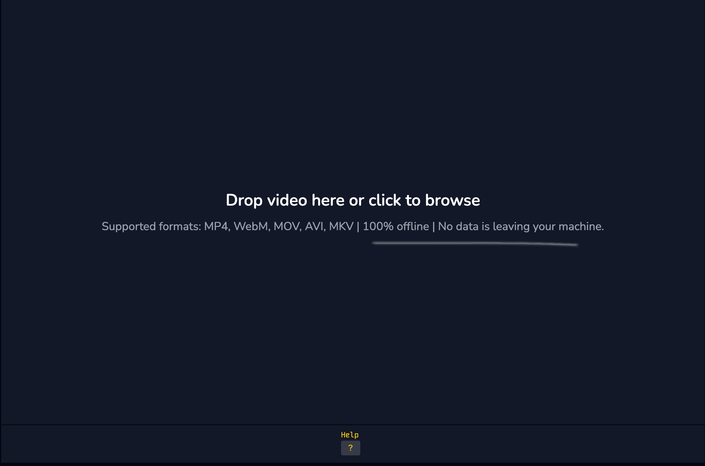

When you first open MIDEO, you'll see the main drop zone. Simply drag and drop your video file here or click to browse your files.

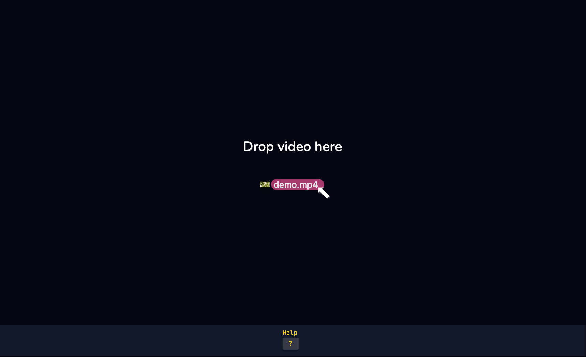

Supported formats include MP4, WebM, MOV, AVI, and MKV. The app processes everything locally—no data leaves your machine.

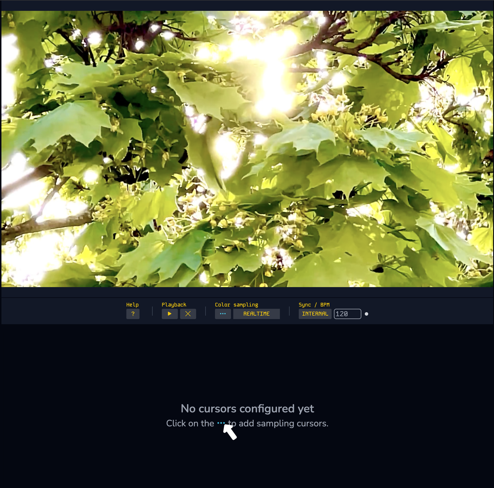

Once your video loads, you'll see the playback controls at the bottom. Click the **⚙️ gear icon** to enable cursor placement mode.

#### <i class="bi bi-2-circle"></i> Cursor Configuration

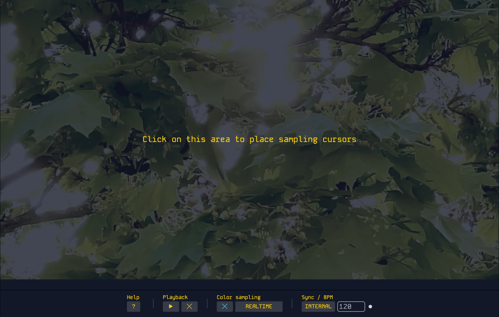

The cursor canvas overlay appears with instructions. Click anywhere on the video to place your first color sampling cursor.

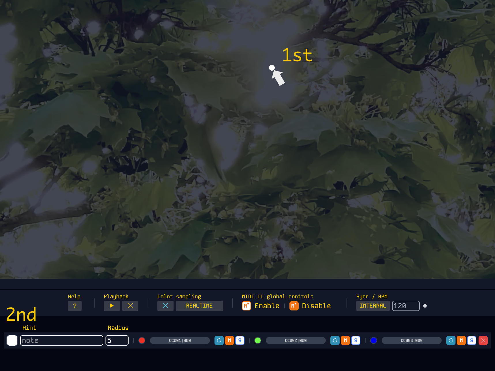

Your first cursor appears on the video, and the control panel opens below showing three RGB channels. Each channel automatically gets assigned a MIDI CC number.

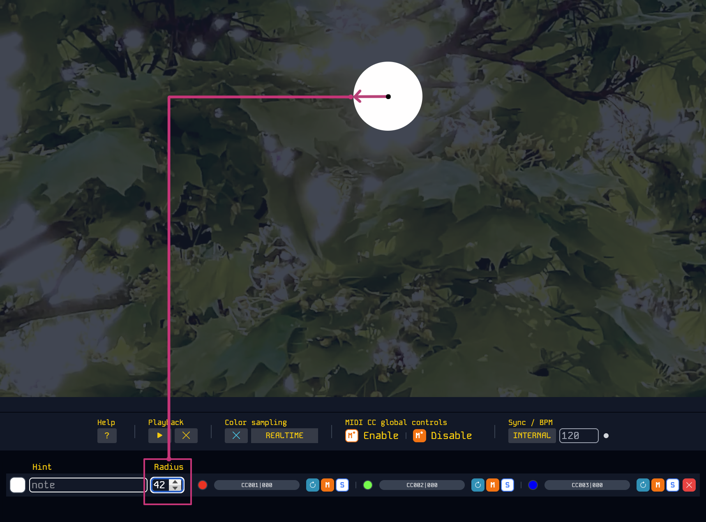

Adjust the **sampling radius** to control how large an area each cursor samples. Larger radius = smoother color averaging. Smaller radius = more precise sampling.

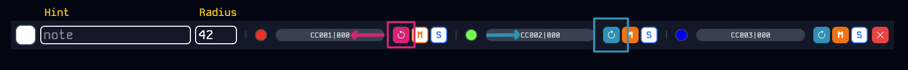 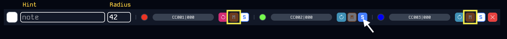

Use the individual channel controls to:
- **Mute/Solo** individual RGB channels (DAW-style workflow)
- **Enable/Disable** channels completely  
- **Assign custom CC numbers** for your DAW
- **Set MIDI channels** (1-16)

#### <i class="bi bi-3-circle"></i> App Controls

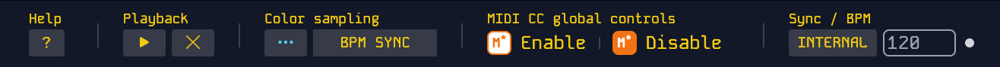

The main control bar provides access to all core functions:

**Color Sampling Modes:**
- **REALTIME** - Continuous 30ms sampling while video plays
- **BPM SYNC** - Sample at musical intervals based on tempo

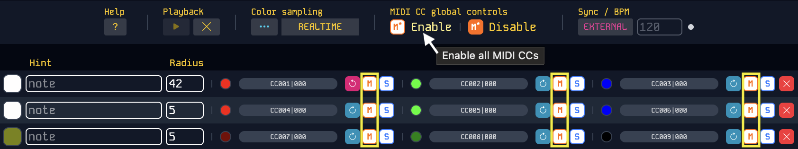 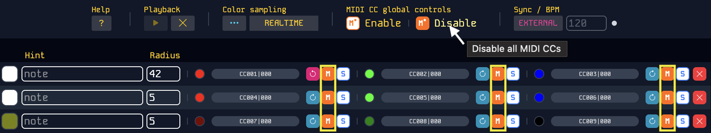

**MIDI CC Global Controls:**
- **Enable All** - Activate MIDI output for all cursors at once
- **Disable All** - Instantly mute all MIDI output

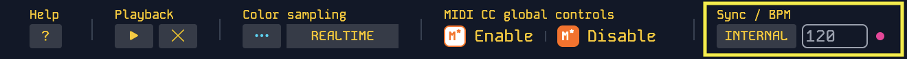

**Sync Options:**
- **INTERNAL** - Use MIDEO's built-in tempo (adjustable BPM)
- **EXTERNAL** - Sync to your DAW's master clock via MIDI

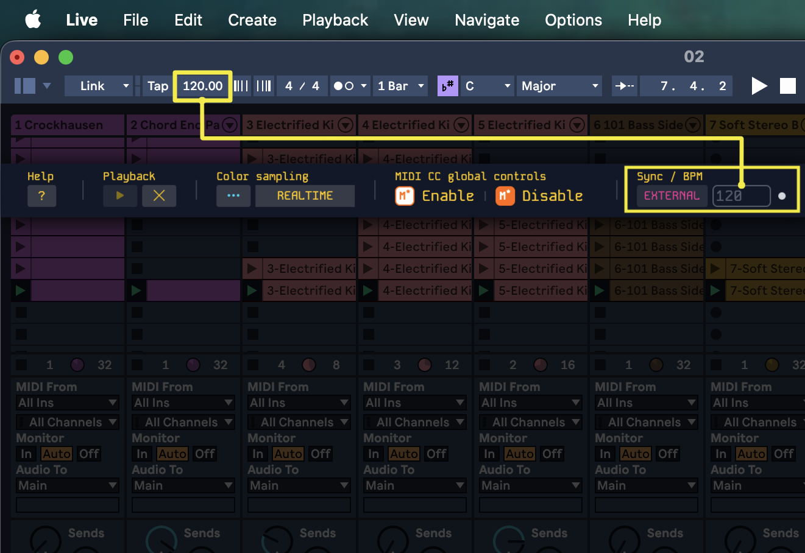

When using external sync, MIDEO will follow your DAW's tempo changes automatically.

#### <i class="bi bi-4-circle"></i> Let's Go!

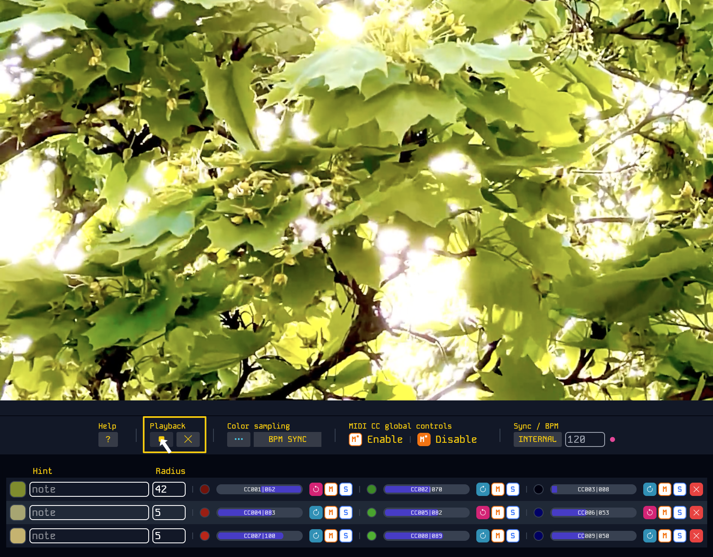

Hit **play** to start generating MIDI! The progress bars show real-time RGB values being converted to MIDI CC data (0-127 range). 

In your DAW:
1. **Select** the parameter you want to control
2. **Enter MIDI learn mode**
3. **Solo** the specific RGB channel in MIDEO
4. **Confirm** the mapping in your DAW

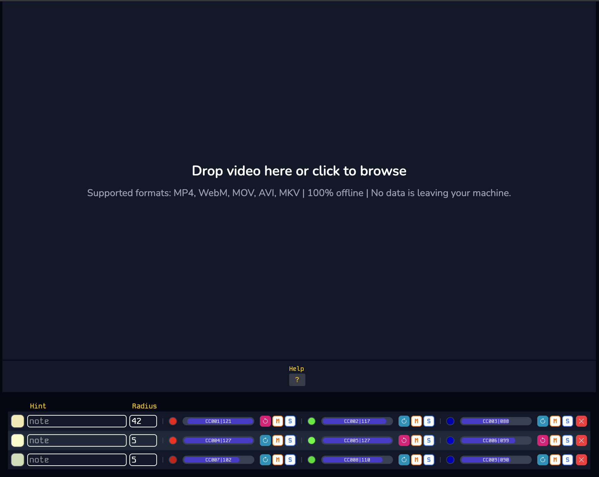

Use the **Stop** button to pause, or load a new video to start fresh. Your cursor configurations are preserved when switching videos.

### <i class="bi bi-music-note"></i> MIDI Mapping Workflow

For precise parameter mapping in your DAW:

1. **Solo the target CC** - Isolates that signal for clean mapping
2. **Enter MIDI learn mode** - In your DAW, select the parameter to control  
3. **Start video playback** - Color changes trigger MIDI CC output
4. **Confirm mapping** - Your DAW establishes the connection
5. **Set parameter range** - Adjust min/max values to taste
6. **Repeat or finish** - Map more CCs or exit learn mode

Pro tip: Choose high-contrast video areas for more dramatic automation curves.

### <i class="bi bi-sliders2"></i> Channel Controls

Each cursor outputs three channels (RGB) with individual controls:

| Control | Function |
|---------|----------|
| **CC Number** | MIDI controller assignment (auto-assigned, manually adjustable) |
| **MIDI Channel** | Output channel (1-16) |
| **Mute/Solo** | DAW-style channel isolation |
| **Enable** | Master on/off per channel |
| **Root Point** | Progress bar direction (left-to-right or right-to-left) |

---

## <i class="bi bi-lightbulb"></i> Creative Applications

**Music Videos**  
Sample beat-synchronized color changes for rhythmic filter automation

**Abstract Visuals**  
Use smooth color gradients for evolving ambient textures and pads

**Performance Content**  
Map stage lighting changes to reverb, delay, or spatial effects

**Motion Graphics**  
Turn animated elements into precise automation curves for synthesis parameters

### Example Session

Load a music video with strong visual elements, then place cursors strategically:
- **Lead visuals** → Filter cutoff frequency
- **Background colors** → Reverb send amount
- **Text/graphics** → Distortion drive level
- **Lighting changes** → Delay feedback

Record the MIDI output while the video plays to capture your automation as editable CC data.

---

## <i class="bi bi-question-circle"></i> Troubleshooting

**No MIDI output detected?**  
Verify your virtual MIDI bus is active and selected as input in your DAW.

**Cursor dragging not working?**  
Desktop: Hover briefly to enable drag mode. Touch: Should work immediately.

**Video won't load?**  
Check format compatibility. MP4 works best across all platforms.

**Performance issues?**  
Reduce the number of active cursors or lower video resolution.

---

*Berlin 2026 | [cafe del cadence](https://cafedelcadence.bandcamp.com)*
