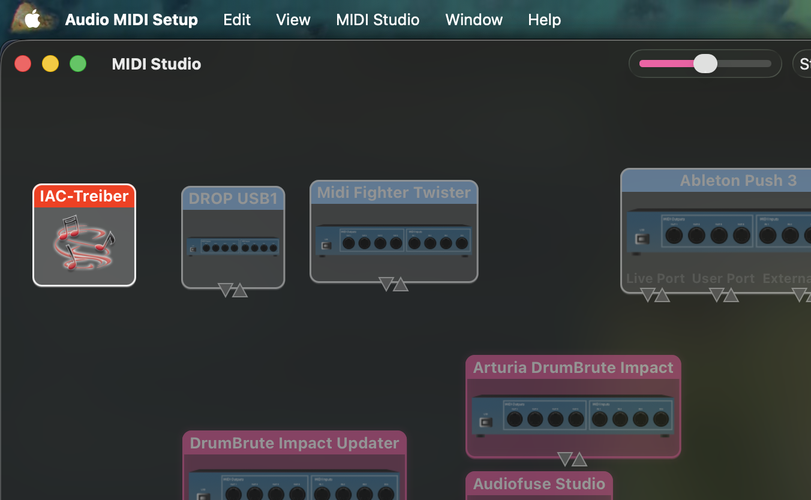
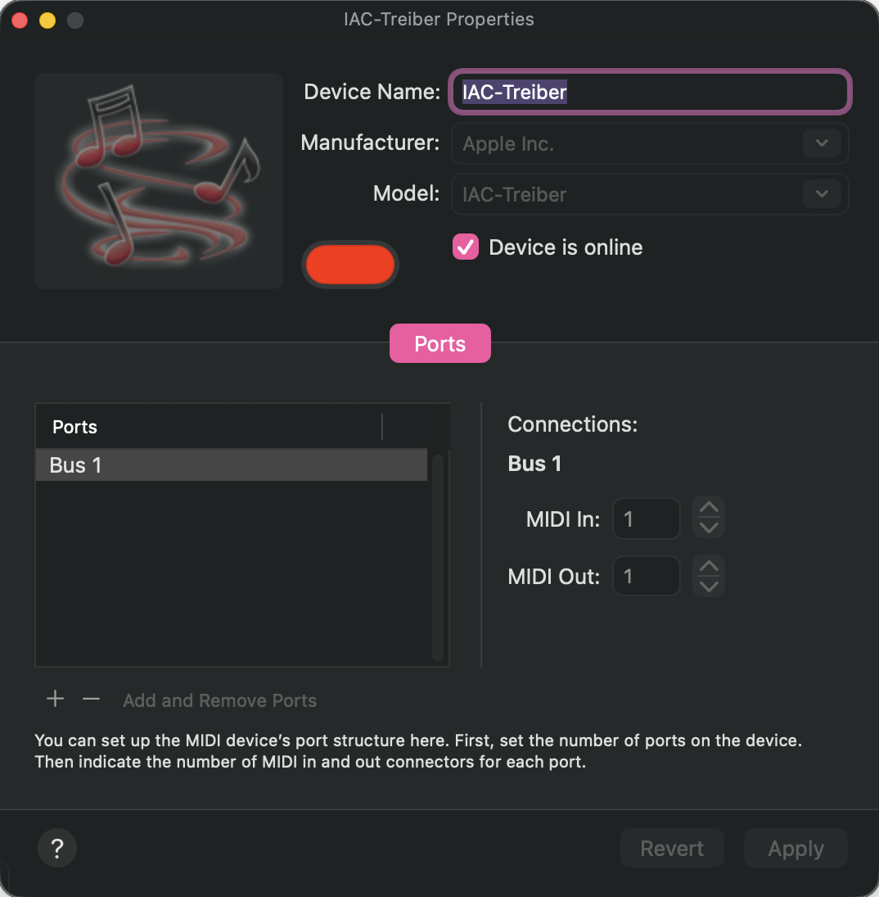

# MIDEO

**Video-driven MIDI automation for creative sound design.**

Turn any video into a MIDI controller. MIDEO extracts color data from video frames and translates RGB values into MIDI CC messages in real-time. Perfect for automating parameters in your DAW with visual content.

## <i class="bi bi-palette"></i> What It Does

Place cursors anywhere on a playing video. Each cursor samples the color beneath it and outputs three MIDI CC values (RGB channels, 0-127). Connect to Ableton, Logic, Bitwig, or any MIDI-capable software to automate filters, effects, or any parameter you can imagine.

**Core features:**
- Real-time color sampling with multiple cursor positioning
- Standard MIDI CC output (compatible with all DAWs)
- DAW-style controls: mute, solo, enable per channel
- Touch and desktop support with drag positioning
- 100% offline processing

---

## <i class="bi bi-gear-fill"></i> Setup

### MIDI Bus Configuration

Before anything else, you need a virtual MIDI bus so your DAW can receive MIDEO's output.

**macOS**  

Open Audio MIDI Setup → Window → Show MIDI Studio → Double-click IAC Driver → Check "Device is online"

**Windows**  
Download [loopMIDI](https://www.tobias-erichsen.de/software/loopmidi.html), create a virtual port

**Linux**  
Use ALSA (`modprobe snd-virmidi`) or JACK MIDI

### Getting Started

1. **Load your video** - Drag & drop or click to browse (MP4, WebM, MOV, AVI, MKV)
2. **Enable cursor overlay** - Click the three dots button in the control bar
3. **Place cursors** - Click anywhere on the video to start sampling
4. **Configure channels** - Adjust CC assignments, channels, and controls
5. **Connect your DAW** - Select the virtual MIDI bus as input
6. **Map parameters** - Use your DAW's MIDI learn to connect color data to sound

---

## <i class="bi bi-sliders"></i> Getting Started Guide

Ready to turn any video into a dynamic MIDI controller? This walkthrough will get you creating color-driven automation in minutes.

### <i class="bi bi-1-circle"></i> First Start

#### Load Your Creative Canvas

When you first launch MIDEO, you might see a demo setup with leafy visuals and some pre-configured sampling cursors. That's just to show you what's possible! 

For this walkthrough, we'll start fresh. Simply drag any video onto this area or click to browse your files—think of it as choosing the visual foundation for your next musical adventure.

Choose a video that speaks to you creatively. Whether it's abstract motion graphics, nature footage, or gradient visuals, MIDEO works with MP4, WebM, MOV, AVI, and MKV formats. 

Everything happens right here in your browser—your videos stay completely private and never leave your machine.

Perfect! Your video is now loaded and ready for creative exploration. Notice two new sections have appeared:

- **App controls** — your global command center  
- **Cursor configuration** — where the magic happens (currently waiting for your first cursor)

Time to place your first color sampler. Click those **three dots** in either the cursor configuration area or the app controls above.

#### <i class="bi bi-2-circle"></i> Cursor Configuration

Welcome to your creative playground! The cursor overlay is now active—click anywhere on the video to drop your first color sampler. Each click places a new "eye" that watches the colors beneath it and translates them into MIDI CC data.

Once placed, you can drag cursors around to fine-tune their position or adjust their behavior in the configuration panel below.

**Pro tip:** Your cursor setups are automatically saved in your browser, so your creative configurations persist between sessions. Switch videos and your cursor positions adapt to the new visual—perfect for building reusable automation templates.

**Here's what you can shape for each cursor:**

- **Note field** — Label your cursors ("lead brightness," "bass pulse," etc.)
- **Sampling radius** — Control the smoothness vs. precision of color detection
- **Live RGB values** — Watch real-time color translation with 0-100% indicators
- **Root point direction** — Flip the automation curve when needed
- **Individual channel mute/solo** — Isolate specific colors for clean MIDI learning

#### Fine-Tuning Your Color Samplers

Excellent! Your first cursor is active and the RGB control panel has appeared below. Notice how each color channel gets its own MIDI CC assignment automatically—red, green, and blue all ready to drive different parameters in your DAW.

The default small radius gives you precise, pixel-level sampling. This creates sharp, immediate automation curves—perfect for rhythmic effects or dramatic parameter jumps. But music often calls for something more fluid...

**Dialing in the Feel**

Expand the radius for smoother, more musical automation. A larger sampling area averages all the pixels within the circle, creating gentle curves instead of jagged jumps. Think of it as the difference between a staccato stab and a flowing pad sweep.

- **Small radius** — Tight, responsive, great for percussion triggers
- **Large radius** — Smooth, flowing, perfect for filter sweeps and ambient textures

**Root Point: Flipping the Script**

Sometimes your automation needs to work backwards. Toggle the root point to "right" and dark colors become high values instead of low ones. This is incredibly useful for parameters like low-pass filters, where you want bright colors to open the filter up, not close it down.

#### Solo Mode: Clean MIDI Learning

Here's where MIDEO shows its DAW-inspired design. Hit that **S** button to solo any RGB channel, instantly muting all other MIDI output. This is your secret weapon for clean parameter mapping.

**Why solo matters:** When you're in your DAW's MIDI learn mode, you want only one CC signal coming through. Solo the exact color channel you need, map it to your filter cutoff or reverb send, then move on to the next parameter. No confusion, no accidental mappings.

**Channel Control at Your Fingertips:**
- **Solo (S)** — Isolate one channel for focused mapping
- **Mute (M)** — Temporarily silence channels without losing their settings
- **Enable/Disable** — Completely turn channels on or off

#### <i class="bi bi-3-circle"></i> App Controls: Your Global Command Center

The control bar is mission control for your entire setup. Here's where you shape how MIDEO responds to your visuals and integrates with your music production workflow.

**Sampling Modes: Choose Your Vibe**

Next to those three dots, you'll find the heart of MIDEO's timing engine. Choose between fluid real-time response or locked-in musical timing:

**REALTIME** — Ultra-responsive 30ms color sampling that follows every visual nuance. Perfect for ambient textures, film scoring, or when you want your automation to breathe with organic video content.

**BPM SYNC** — Lock your color changes to musical time. This transforms random visual events into rhythmically quantized automation that sits perfectly in the pocket with your drums and bass.

**Global Enable/Disable: Master Control**

Hit **Enable All** when you're ready to unleash all your cursors at once. Just make sure you've finished your MIDI learning in your DAW first—you don't want all those CCs firing while you're trying to map a specific parameter!

**Disable All** gives you instant silence across all cursors. Think of it as your emergency mute button or a way to pause all automation while you adjust your mix.

#### Sync Options: Lock to the Beat

When you switch to BPM SYNC mode, choose your timing source:

**INTERNAL** — MIDEO becomes the master clock. Set your BPM in the field and independently drive the tempo. Great for playing around and do some jamming where reproducibility is less important or you're on a path of inspiration.

**EXTERNAL** — Let your DAW lead the way. MIDEO will follow tempo changes, stops, and starts from your session. Perfect for studio work where your track is already laid down or demand reproducible results.

External sync locks MIDEO to your DAW's master clock via MIDI. Now both video playback and color sampling march to your session's beat—every visual change happens precisely on musical time. The BPM field becomes read-only, showing your DAW's current tempo.

#### <i class="bi bi-4-circle"></i> Let's Go! Time to make your visuals sound

**This is where visuals become music.** Hit play (or start your DAW if synced externally) and watch those progress bars come alive with real-time RGB data flowing as MIDI CC values.

**Your Creative Workflow:**

1. **Solo your first color** — Pick a channel that catches your eye (or ear!)
2. **Choose your sonic target** — Filter cutoff? Reverb send? Go wild.
3. **Enter MIDI learn mode** in your DAW 
4. **Let the magic flow** — Play the video and watch your parameter dance
5. **Confirm and celebrate** — Your DAW locks in the mapping
6. **Rinse and repeat** — Solo the next channel and claim another parameter

**Pro tip:** Set external sync and map one color at a time. This workflow keeps everything clean and musical—no rogue CCs disrupting your creative flow.

**Ready for fresh inspiration?** Hit the yellow "X" button beside play/stop to hot-swap videos while keeping all your cursor wizardry intact. Your sampling setup becomes a reusable creative instrument ready for any visual content you throw at it.

### <i class="bi bi-music-note"></i> MIDI Mapping Workflow

For precise parameter mapping in your DAW:

1. **Solo the target CC** - Isolates that signal for clean mapping
2. **Enter MIDI learn mode** - In your DAW, select the parameter to control  
3. **Start video playback** - Color changes trigger MIDI CC output
4. **Confirm mapping** - Your DAW establishes the connection
5. **Set parameter range** - Adjust min/max values to taste
6. **Repeat or finish** - Map more CCs or exit learn mode

Pro tip: Choose high-contrast video areas for more dramatic automation curves.

### <i class="bi bi-sliders2"></i> Channel Controls

Each cursor outputs three channels (RGB) with individual controls:

| Control | Function |
|---------|----------|
| **CC Number** | MIDI controller assignment (auto-assigned, manually adjustable) |
| **MIDI Channel** | Output channel (1-16) |
| **Mute/Solo** | DAW-style channel isolation |
| **Enable** | Master on/off per channel |
| **Root Point** | Progress bar direction (left-to-right or right-to-left) |

---

## <i class="bi bi-lightbulb"></i> Creative Applications

**Music Videos**  
Sample beat-synchronized color changes for rhythmic filter automation

**Abstract Visuals**  
Use smooth color gradients for evolving ambient textures and pads

**Performance Content**  
Map stage lighting changes to reverb, delay, or spatial effects

**Motion Graphics**  
Turn animated elements into precise automation curves for synthesis parameters

### Example Session

Load a music video with strong visual elements, then place cursors strategically:
- **Lead visuals** → Filter cutoff frequency
- **Background colors** → Reverb send amount
- **Text/graphics** → Distortion drive level
- **Lighting changes** → Delay feedback

Record the MIDI output while the video plays to capture your automation as editable CC data.

---

## <i class="bi bi-question-circle"></i> Troubleshooting

**No MIDI output detected?**  
Verify your virtual MIDI bus is active and selected as input in your DAW.

**Cursor dragging not working?**  
Desktop: Hover briefly to enable drag mode. Touch: Should work immediately.

**Video won't load?**  
Check format compatibility. MP4 works best across all platforms.

**Performance issues?**  
Reduce the number of active cursors or lower video resolution.

---

*Berlin 2026 | [cafe del cadence](https://cafedelcadence.bandcamp.com)*
